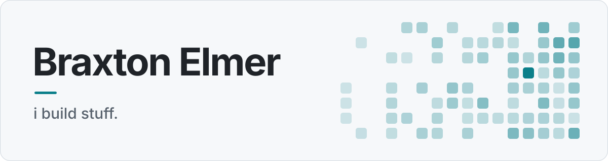

<a href="https://braxtonelmer.com">
  <picture>
    <source media="(prefers-color-scheme: dark)" srcset="docs/banner-dark.svg">
    
  </picture>
</a>

## Things I've shipped

Small, fast apps that fix one annoying thing well. Free, open source, no accounts, no telemetry.

| | | |
| --- | --- | --- |
| **[Pixl](https://github.com/BraxtonElmer/pixl)** | Protect your OLED from burn-in. Blacks out the screens you choose when you step away, while your PC keeps running. | Windows · Rust · Tauri |
| **[ScreenStitch](https://github.com/BraxtonElmer/ScreenStitch)** | Stops the cursor jumping between monitors of different sizes by joining screens at their real physical size. | Windows · Rust · Tauri |
| **[nomnom](https://github.com/BraxtonElmer/nomnom)** | Free calorie and macro tracker. Type what you ate in plain words, get numbers from real food tables. | Android · Flutter |
| **[paimom](https://github.com/BraxtonElmer/paimom)** | Discord bot with character builds, resource management and scheduling tools for Genshin Impact players. | TypeScript |
| **[StreamPresence](https://github.com/BraxtonElmer/StreamPresence)** | Lightweight Discord Rich Presence client that shows what you're streaming, with titles, episodes and posters. | JavaScript |

## What I work with

## Activity

<picture>
  <source media="(prefers-color-scheme: dark)" srcset="https://github-readme-stats.vercel.app/api?username=BraxtonElmer&show_icons=true&theme=transparent&hide_border=true&title_color=2bb5c4&icon_color=2bb5c4&text_color=8b949e&hide_title=true">
  
</picture>
<picture>
  <source media="(prefers-color-scheme: dark)" srcset="https://github-readme-stats.vercel.app/api/top-langs/?username=BraxtonElmer&layout=compact&theme=transparent&hide_border=true&title_color=2bb5c4&text_color=8b949e">
  
</picture>

## Say hi

Building something and want a hand? Email me at [mail@braxtonelmer.com](mailto:mail@braxtonelmer.com) or find me on [LinkedIn](https://www.linkedin.com/in/braxtonelmer/).
